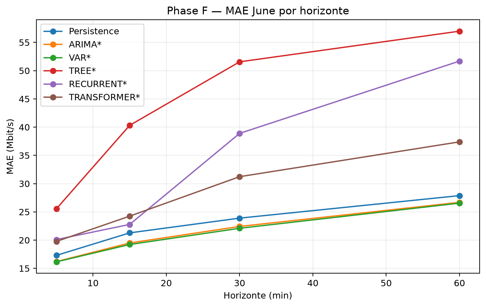
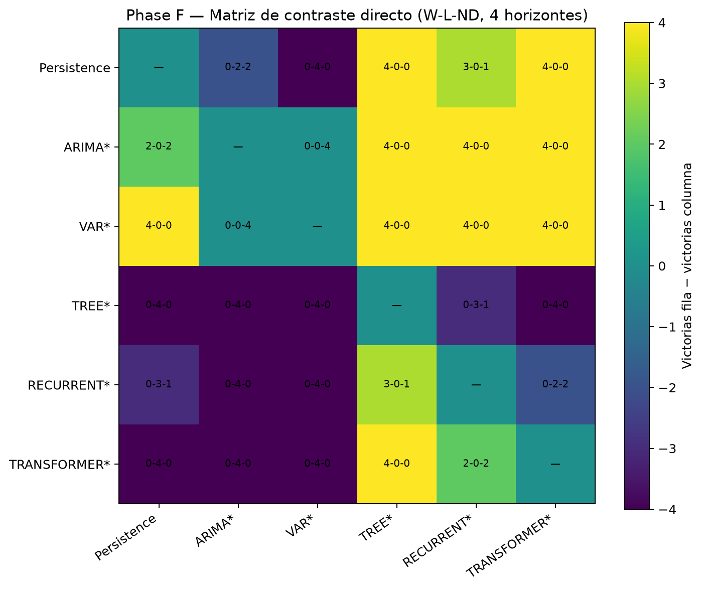
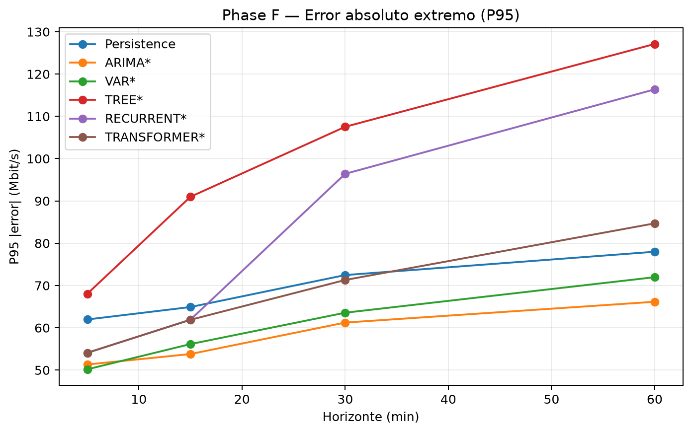

# IP Traffic Forecasting with Machine Learning

Public engineering/research repository derived from the Master's Thesis
**“Predicción de tráfico IP mediante aprendizaje automático”**, developed at
the Universidad Miguel Hernández de Elche (EPSE), Master in
Telecommunications Engineering.

This repository presents a curated, portable subset of the final project:
research code, selected metrics, manifests, reports and figures. It is designed
to be useful to **recruiters, engineers and researchers** without turning the
academic working tree into a public backup.

## What this project studies

The project compares heterogeneous forecasting families for multihorizon IP
traffic prediction using the **UGR'16** traffic dataset. The experimental design
separates development, model/configuration selection and external evaluation
across time instead of treating all captures as interchangeable.

| Capture | Methodological role |
| --- | --- |
| March Week #3 | Development and screening |
| April Week #3 | Configuration and representative selection |
| June Week #3 | Principal external / blind evaluation |
| June Week #4 | Complementary training-history sensitivity experiment |

June Week #4 is not a new global model-selection stage; it supports the
complementary Phase G analysis of sensitivity to the amount/history of
training data.

## Model families

The final study covers persistence/baselines and heterogeneous statistical,
machine-learning and deep-learning approaches, including:

- AR / MA / ARMA and ARIMA;
- VAR;
- Ridge;
- tree ensembles and boosting;
- RNN, LSTM and GRU;
- a lightweight Transformer;
- cross-family comparison across multiple forecast horizons.

SARIMA was explored during the project but is not presented as a universal
reference model.

## Main interpretation

The final evidence supports **no universal winner**. Model behaviour depends
on forecast horizon, metric, temporal regime, training history, stability,
computational cost and evaluation capture.

The principal external evaluation on **June Week #3** highlights the
competitiveness of statistical families such as **ARIMA** and **VAR**, without
claiming that either is universally superior. Likewise, the repository does
not claim that deep learning or the Transformer dominates all other families.

## Experimental workflow

```text
March Week #3
    ↓ development / screening
April Week #3
    ↓ configuration and representative selection
June Week #3
    ↓ principal external / blind evaluation
June Week #4
    ↓ complementary training-history sensitivity (Phase G)
```

The historical workflow combined **Ubuntu under WSL2** with selected
**Google Colab** GPU executions. The public repository provides a portable
CPython 3.12 reference environment while documenting runtime-specific Colab
evidence separately.

## Repository structure

```text
.
├── README.md
├── RIGHTS.md
├── CITATION.cff
├── requirements.txt
├── .gitignore
├── src/
│   ├── data/
│   ├── models/
│   │   ├── statistical/
│   │   ├── tree/
│   │   ├── recurrent/
│   │   └── transformer/
│   └── evaluation/
├── notebooks/
├── results/
│   ├── metrics/
│   └── figures/
├── data/
│   └── README.md
└── docs/
    ├── methodology.md
    ├── reproducibility.md
    ├── data_provenance.md
    └── limitations.md
```

The repository intentionally excludes the academic manuscript, internal
governance/handoff files, raw working archives, caches and historical
intermediate revisions.

## Quick start

A reference local environment can be created with CPython 3.12:

```bash
python3.12 -m venv .venv
source .venv/bin/activate
python -m pip install --upgrade pip
python -m pip install -r requirements.txt
```

Then obtain the UGR'16 data separately and place locally acquired/generated
files according to [`data/README.md`](data/README.md).

The repository does **not** contain the raw, interim or processed datasets, and
does not publish aligned prediction payloads that could partially reconstruct
the evaluation data.

## Reproducibility boundary

This is a reproducible research repository **up to the data-distribution
boundary**. The code, selected outputs, manifests and environment information
are provided, but dataset acquisition remains external. Full scientific
reproduction therefore requires legitimate access to the original UGR'16 data
and recreation of the documented local data products.

See:

- [Methodology](docs/methodology.md)
- [Reproducibility](docs/reproducibility.md)
- [Data provenance](docs/data_provenance.md)
- [Limitations](docs/limitations.md)

## Selected public figures

### ugr16 global cross family 01 mae by horizon



### ugr16 global cross family 04 primary direction matrix



### ugr16 global cross family 06 p95 absolute error



## Results and artifacts

Curated public outputs include final June-blind metrics, residual/inference
summaries, cross-family analysis, selected manifests/provenance and Phase G
training-history sensitivity artifacts. Large prediction tables, Parquet
payloads and recovery bundles are deliberately excluded.

The repository preserves the final scientific narrative rather than
re-running model selection to create a different GitHub-specific result.

## Citation

Citation metadata are provided in [`CITATION.cff`](CITATION.cff). The
repository and the academic thesis are related artifacts; cite the thesis as
well when your use depends on the academic methodology or conclusions.

## Rights

This repository currently has **no open-source license**. See
[`RIGHTS.md`](RIGHTS.md). Dataset and third-party rights remain separate from
the author's rights in the original repository material.
